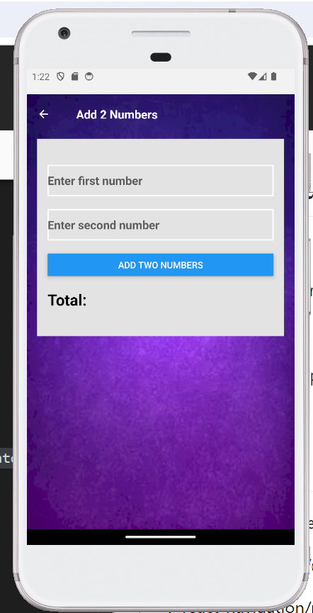
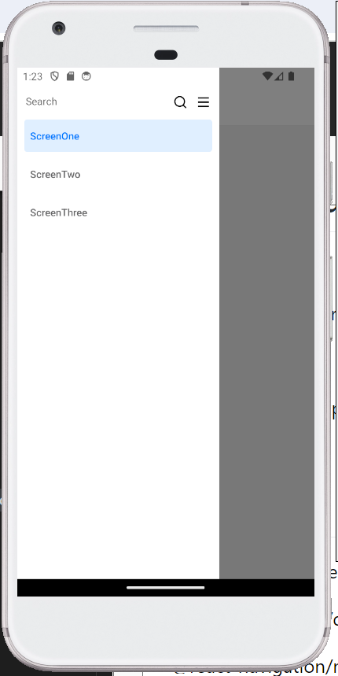
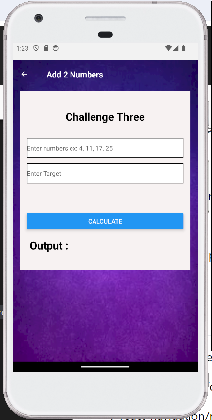

# Interview Assesment

This project is built using React Native (Expo) which covers 3 challenges

1 - Adding two numbers

2 - Menu Navigation

3 - Calculating Two numbers

# App Screens

# How to run

1 - Clone the repo

2 - Go inside the directory

3 - yarn install

4 - yarn android-expo (Test with emullator or device)

# Packages Used

@hookform/resolvers": "^3.6.0"

@react-navigation/drawer": "^6.6.15"

@react-navigation/native": "^6.1.17"

@react-navigation/native-stack": "^6.9.26"

expo": "~51.0.13"

expo-status-bar": "~1.12.1"

nativewind": "^2.0.11"

react": "18.2.0"

react-hook-form": "^7.51.5"

react-native": "0.74.2"

react-native-gesture-handler": "^2.16.2"

react-native-reanimated": "3.10.1"

react-native-remix-icon": "^0.4.0"

react-native-safe-area-context": "4.10.1"

react-native-screens": "3.31.1"

react-native-svg": "^15.3.0"

yup": "^1.4.0"
